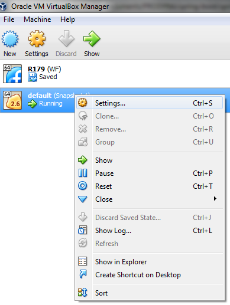
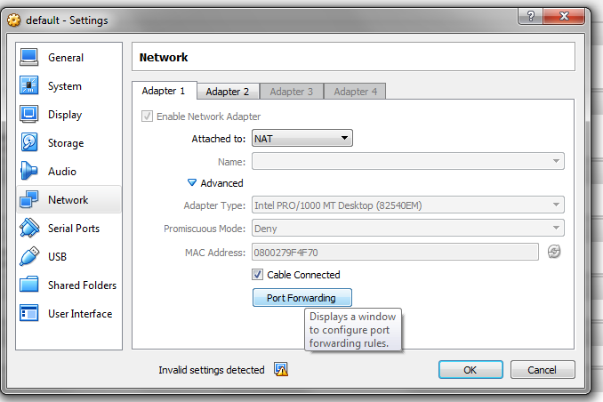
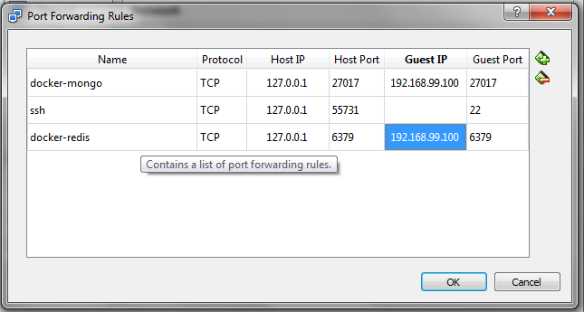

# spring-boot-workshop

### About repository
The repository is a collection of materials for spring boot training. It contains a few small maven projects with code example, training documentation and docker configuration.

### Preparation for the training

#### Required knowledge
Before then we start with training, everyone has to be familiar with the following things:
* Java 8 - especially basic of stream API and lambdas. 
* [Lombok](https://projectlombok.org)  - it’s small library, but very useful. JavaMagazin [tutorial](http://www.javamagazine.mozaicreader.com/MayJune2017/Twitter#&pageSet=10&page=0&contentItem=undefined).
* Concept of JUnit with Mockito testing.
* Concept of dependency injection in Spring.
* Maven 
* Git

#### Development environment
##### JDK & IDE
As it’s mentioned above  we will use Java 8 and Lombok, than you need following:
* JDK 8 - installed on your machine
* IntelliJ/Eclipse/Netbeans - one of them, your favorite. 
* Lombok plugin -  you have to install lombok plugin, it’s straightforward.
* Git/SourceTree/etc - choose one git client that you prefer.
##### DBs
This training is going to cover usage spring data/cache with MongoDB and Redis, therefore we will need these databases installed. 
Since Redis doesn’t have official support for windows, we are going to use Docker. In order to setup dev environment you should do next steps:
* Install Docker
    * Windows 10/Mac/Linux - it should be straightforward
    * Windows 7 - you have to use docker toolbox, please read carefully instruction on Docker site.
* Configure Docker/VirtualBox(Windows 7 only!) - because you run docker inside of VirtualBox, you have to manually configure port redirection.
     
     
    
* Run Docker
* Clone this project to your machine
* goto [PROJECT_DIR]/docker 
* start containers
    ```
    $./starup.sh
    $ docker ps
    CONTAINER ID        IMAGE               COMMAND                  CREATED                  STATUS              PORTS                      NAMES
    90efa77cff81        mongo:latest        "docker-entrypoint..."   Less than a second ago   Up 8 seconds        0.0.0.0:27017->27017/tcp   pd-mongo
    17cd03e9d433        redis:alpine        "docker-entrypoint..."   Less than a second ago   Up 8 seconds        0.0.0.0:6379->6379/tcp     pd-redis
    ```
* Import the project `spring-boot-workshop` into your IDE
* Run test TestEnvApplicationTests.java, it should be green.
* If you have any problem don't hesitate to ask for help :)