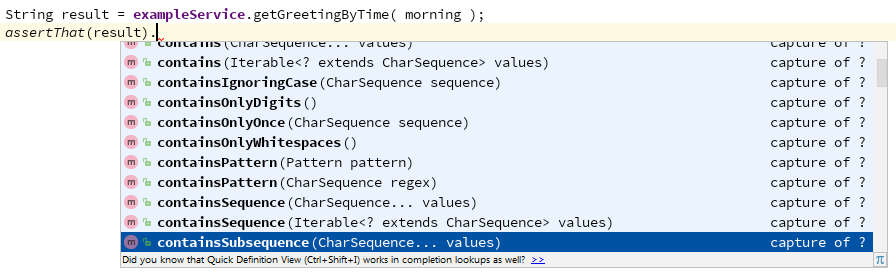

## TESTING SPRING BOOT APPLICATION WITH AssertJ AND MOCKITO

This tutorial has aim to teach you how to test your spring boot application
with Mockito and AssertJ. Also if you are new in spring-boot, this should be the first
thing you have learnt. 

Tests are part of application architecture, and they are very important for many reasons, 
but here I'm gonna explain why test are very important for learning:
- Every software are built from many building blocks, and every building block belongs to 
the different layer of application(repository, service, ... ), every building block uses different 
framework/module. Test allows us to focus on exactly one building block and one framework/technology. 
But if you try to write the simplest application, and test it manually, it will be hard to create
test conditions as you need for test and if you face some error, because of many components and many frameworks
it will be very hard to locate where error is. 
- As I mentioned, tests are part of application architecture, and it's unimaginable to have application 
without test, and because of that you must learn test now or later. 

### Writing Test Class

Writing a test in a spring boot application is very easy. You have to create a test class in test code
and annotate this test with following annotation `@RunWith( SpringRunner.class )` and `@SpringBootTest`
and then you can inject bean from you application and test it. Example:
```java
@RunWith( SpringRunner.class )
@SpringBootTest
public class ExampleServiceTest {
    @Autowired
    private ExampleService exampleService;
}
```
It is worth to be mentioned that you can define method that executes before/after every test, 
by declaring public method and mark it with annotation `@Before`/`@After`.

### Writing test methods

Modern IDE has possibility to generate test class with test methods, I would use it only for class, but never 
for methods. IDE generates one methods for every method from your target class, and name it test+target_method_name.
But if you want to write clean test, firstly you should write one method for every test case, secondly you should
name test method in way to describe which method you test and which case. You should try to avoid using word `test` 
in method name. Test method must be public, and marked with annotation `@Test`. Example:
```java
    @Test
    public void getGreetingByTimeReturnsMorningMessageBetweenMidnightAndNoon()
    
    @Test
    public void getGreetingByTimeReturnsAfternoonMessageBetweenNoonAndFivePm()

    @Test
    public void getGreetingByTimeReturnsEveningMessageBetweenFivePmAndMidnight()
```
In example above we want to test method ExampleService.getGreetingByTime, and instead of writing one method testGetGreetingMessageByTime, we
write three methods for every case. Usually test method executes target method and assert result for the case.

### Assertion result 

Spring boot by default include JUnit and AssertJ assertion, you can use one of them, but I would recommend using AssertJ because it provides
fluent API assertion, which simplify writing test. You have to import static `org.assertj.core.api.Java6Assertions.assertThat`, than use
assertThat method in your test. It help you, because of fluent API, IDE will offer appropriate method according to argument type i.e.:


Example of one test case: 
```java
    @Test
    public void getGreetingByTimeReturnsMorningMessageBetweenMidnightAndNoon() {
        final String expectedMorningMessage = "Good morning!";
        final LocalTime morning = LocalTime.of( 6, 1 );

        String result = exampleService.getGreetingByTime( morning );
        assertThat(result).isEqualTo( expectedMorningMessage );
    }
```
##### Exception assertion 
We can use old fashioned way to assert exception with mark method with `@ExpectedException` or `try/catch` exception and assign it to a local variable, 
and check it after. But the first approach is not enough good, because we can't check for example exception message, or a property of exception. Second 
approach is better, but is not so readable and it does not follow other test. Thanks to AssertJ and Java 8 we have possibility to write this
test more elegant. AssertJ has static method assertThatThrownBy, with __lambda__ argument, and API which allows methods chain. Example:
```java
    @Test
    public void getGreetingByTimeThrowsExceptionForNullTime() {
        final String expectedErrorMessage = "Time must be a non null value.";
        
        assertThatThrownBy( () -> exampleService.getGreetingByTime( null ) )
                .isInstanceOf( NullPointerException.class )
                .hasMessage( expectedErrorMessage );
    }
```

### Mocking

Very often your component use another component that is writen by someone else, or even worse scenario it isn't implemented yet, 
or an external component that isn't runnable in dev environment(social network api, SAP api, etc ). In all those cases, you 
want to test only your code, and often you don't have possibility to execute methods of external service. In those cases we use
Mockito, one of the most popular Java mocking frameworks. It is included in `spring-boot-starter-test` by default. To use Mockito
in our test, we have to do next steps: declare field of that related component, annotate field with ``@MockBean``, set up mock to 
simulate real service. To make things more clear let's analyze following example:
```java
@Service
public class MessageService {
    private static final String MESSAGE_FORMAT = "Info: %s";
    
    @Autowired
    private InfoService infoService;

    public boolean sendInfo(String phoneNumber, String infoMessage) {
        boolean messageHasBeenSent = false;
        if(infoService.hasSubscription( phoneNumber )) {
            infoService.sendMessage( phoneNumber, String.format(MESSAGE_FORMAT, infoMessage ));
            messageHasBeenSent = true;
        }
        return messageHasBeenSent;
    }
}
```
This simple example use an external library/system to check if a number has subscription and send message
to the number. Let's first write test for case when number doesn't have a subscription:
```java
@RunWith( SpringRunner.class )
@SpringBootTest
public class MessageServiceTest {
    private static final String TEST_NUMBER = "064555333";
    private static final String TEST_MESSAGE = "An informative message";
    @Autowired
    private MessageService messageService;

    @MockBean
    private InfoService infoService;

    @Test
    public void messageHasNotBeenSentForNotSubscribedNumber() {
        doReturn( false )
                .when( infoService )
                .hasSubscription( anyString() );

        assertThat(messageService.sendInfo( TEST_NUMBER, TEST_MESSAGE ))
                .isFalse();
    }
}
``` 
Here we first setup our mock in way to return false, for every call of method has subscription. Beside method `doReturn`, we have
mockito provide as methods:
- `doThrows` - we use it, when we want to emulate call exception
- `doAnswer` - we use it, when we want to return result that we create using method arguments.
- `doNothing` - name says enough 

Let's now write test for happy case:
```java
    @Test
    public void messageHasBeenSentForSubscribedNumber() {
        doReturn( true )
                .when( infoService )
                .hasSubscription( anyString() );

        assertThat(messageService.sendInfo( TEST_NUMBER, TEST_MESSAGE ))
                .isTrue();
    }
```
This test is very similar to previous, and it test that result is true, that is good, but unfortunately not enough good. This test
doesn't tell us, do we call external api and send message in right format to client. Luckily, mockito provides us mechanism that verify that.
First we can refactor our test to be sure that we call infoMessage.sendMessage:
```java
    @Test
    public void messageHasBeenSentForSubscribedNumber() {
        doReturn( true )
                .when( infoService )
                .hasSubscription( anyString() );

        assertThat(messageService.sendInfo( TEST_NUMBER, TEST_MESSAGE ))
                .isTrue();

        verify( infoService, times( 1 ) )
                .sendMessage( anyString(), anyString() );
    }
``` 
Now we are sure that external infoService has been called, but still we don't sure that we call with right message format,
because of that we are going to refactore this one more time:
```java
    @Test
    public void messageHasBeenSentForSubscribedNumber() {
        doReturn( true )
                .when( infoService )
                .hasSubscription( anyString() );

        assertThat( messageService.sendInfo( TEST_NUMBER, TEST_MESSAGE ) )
                .isTrue();

        ArgumentCaptor <String> messageCaptor = ArgumentCaptor.forClass( String.class );

        verify( infoService, times( 1 ) )
                .sendMessage( anyString(), messageCaptor.capture() );

        assertThat( messageCaptor.getValue() )
                .startsWith( "Info: " )
                .endsWith( TEST_MESSAGE );
    }
```
Now thanks to `ArgumentCaptor`, we can verify that we call external service with proper message. Now you can
try to refactor case `messageHasBeenSentForSubscribedNumber` and verify that our code doesn't call infoService.sendMessage.

If you learn all these things, it should be enough to write nice tests, and easy learn new things.